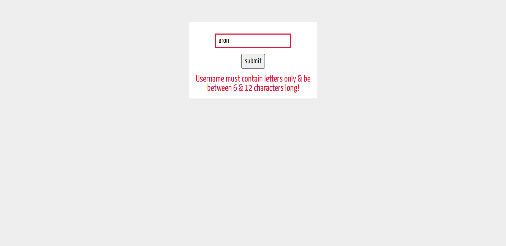
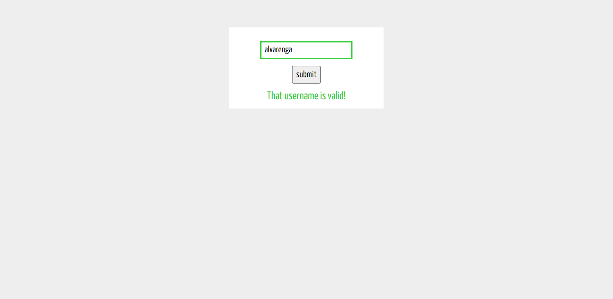

# Validação de input usando Js e RegEx

  

Validação de input usando JavaScript e Expressões Regulares.

## Ferramentas e Tecnologias

- HTML5 - Linguagem de Marcação;
- CSS3 - Folhas de Estilo;
- JavaScript - Linguagem de Programação.

## Imagens

  
  

